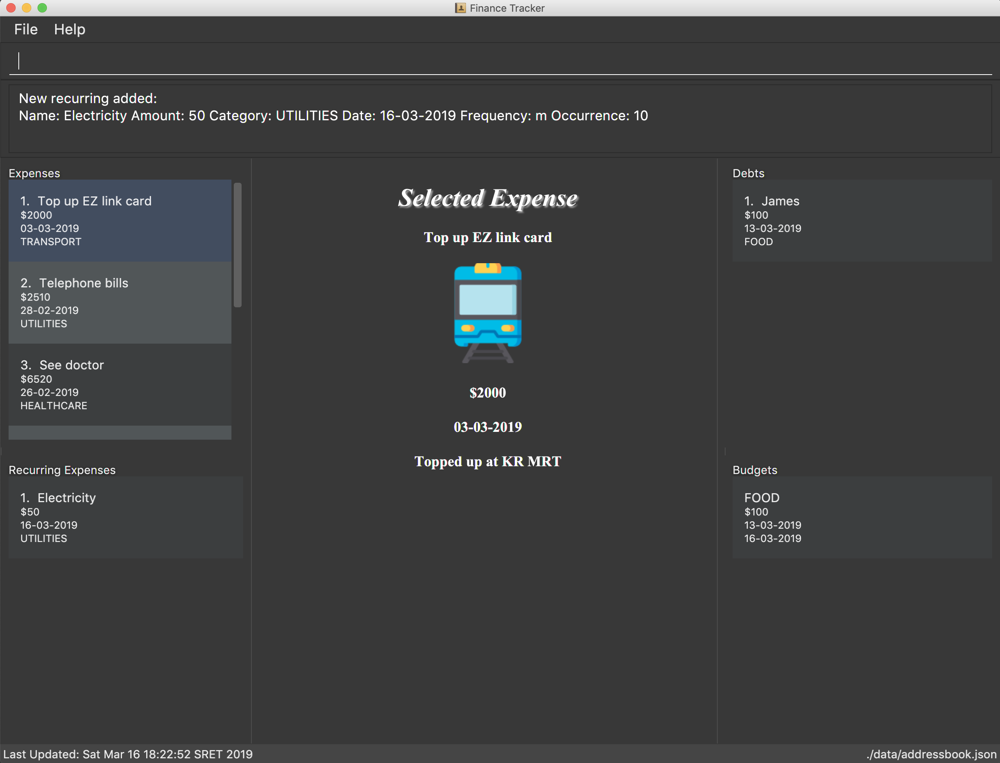

= Personal Finance Tracker
ifdef::env-github,env-browser[:relfileprefix: docs/]

https://travis-ci.org/cs2103-ay1819s2-w15-2/main[image:https://travis-ci.org/cs2103-ay1819s2-w15-2/main.svg?branch=master[Build Status]]
https://coveralls.io/github/cs2103-ay1819s2-w15-2/main?branch=master[image:https://coveralls.io/repos/github/cs2103-ay1819s2-w15-2/main/badge.svg?branch=master[Coverage Status]]

//insert image of our future project here

//ifdef::env-github[]
//endif::[]

//ifndef::env-github[]
//image::images/Ui.png[width="600"]
//endif::[]

* Having trouble tracking your finance? We can help you effortlessly manage your finance with our Personal Finance Tracker application. It has a GUI but most of the user interactions happen using a CLI (Command Line Interface).
* Track expenses?
** Easily keep track of what you have spent on! View various statistics about your spending so that you can plan ahead!
* Budgets?
** Easily create budgets and be constantly aware of your spending limits!
* Bills and debts?
** Keep track of them so that you will never ever miss another deadline!

== Site Map

* <<UserGuide#, User Guide>>
* <<DeveloperGuide#, Developer Guide>>
* <<AboutUs#, About Us>>
* <<ContactUs#, Contact Us>>

== Acknowledgements

* Adapted from https://github.com/se-edu/addressbook-level4[AddressBook-Level4 project] created by https://github.com/se-edu/[SE-EDU iniative]
* Some parts of this sample application were inspired by the excellent http://code.makery.ch/library/javafx-8-tutorial/[Java FX tutorial] by
_Marco Jakob_.
* Libraries used: https://github.com/TestFX/TestFX[TextFX], https://github.com/FasterXML/jackson[Jackson], https://github.com/google/guava[Guava], https://github.com/junit-team/junit5[JUnit5]
